# Artin Hojat - business site

## Livelink https://www.artinhojat.com

# Application overview

This project is a modern, responsive and hopefully user-friendly business website designed and developed for Artin Hojat, a physiotherapist, basketball optimizing coach and content creator. It serves as a central hub to showcase his expertise, provide a platform for his services and provide interactive and engaging content for his visitors.

Building this website allowed me to collaborate and understand his diverse career and it was a unique challenge to try and integrate his multifaceted career into a cohesive and professional design. It required both problem-solving as well as technical development. My focus throughout the process was on the following:

- Vision into design: I worked closely with Artin to bring his ideas to life and ensurng the site accurately reflects his brandidentity and content.

- Interactivity: Crafting an interactive experience through the articles and contact as well as the podcast embedded widget.

# Features

- **Wordpress as a headless CMS**: Section for articles on health, fitness, and performance, using Wordpress as a headless CMS so Artin can post, edit and delete articles on the site using the Wordpress UI.

- **Visual player overview**: A visual representation of the basketball players he has worked with and the specifications of it.

- **Interactive UI**: A contact form for inquiries, connected directly to Gmail via EmailJS.

- **Serverless hosting with AWS Amplify**: The frontend is deployed on AWS Amplify.

- **API integration**: The frontend fetches data dynamically from WordPress via REST API.

- **Optimized search functionality**: Articles can be searched dynamically with a debounced input, improving performance and user experience.

- **Tailwind CSS**: For efficient styling.

- **Manual SSL certificate configuration**: Ensured secure connections with a manually configured SSL certificate for HTTPS support.

- **Custom domain & DNS**: Integrating frontend and backend via Namecheap.

## Lessons learned

The biggest takeaway throughout has been how beneficial it has been for me to grasp an idea of the full process required, in order to develop a ready site with real intended users. I have aqcuired an immense amount of knowledge about how to host a headless CMS as my backend, browsers, urls, and establishing a connection between frontend and backend.
It has also been of importance to ensure that I follow best practises as much as possible, for this application to be ready to use. That entails responsitivity, accessibility, optimizing the performance etc.

- Understanding of a headless CMS & API integration and how to connect a frontend to a WordPress headless CMS required careful API management, ensuring structured data retrieval.

- State management, implementing debouncing, filtering, and pagination.

- Exploring Tailwind for structured styling.

- Planning architecture, I experienced challenges with domains, hosting, and backend integration which reinforced the importance of planning component structure, API strategies, and deployment workflows from the start.

## Author

- [@alahojat](https://www.github.com/alahojat)

## Project built with

- 

- 
- 
- 
- 
- 
- 
- 
- 
- 
- 

## Specifications

- Wordpress as a headless CMS, hosted on AWS Lightsail
- The application is hosted on AWS Amplify

## Project setup

1. Clone

```
git clone <repository-url>
```

2. Navigate to projectfolder

```
cd <project-folder>
```

3. Install dependencies

```
npm install
```

4. Start the dev server

```
npm run dev

```

## Final result in desktop

| **Title**                                               | **Title**                                                   | **Title**                                                               |
| ------------------------------------------------------- | ----------------------------------------------------------- | ----------------------------------------------------------------------- |
| Home                                                    | Articles                                                    | Single article                                                          |
| 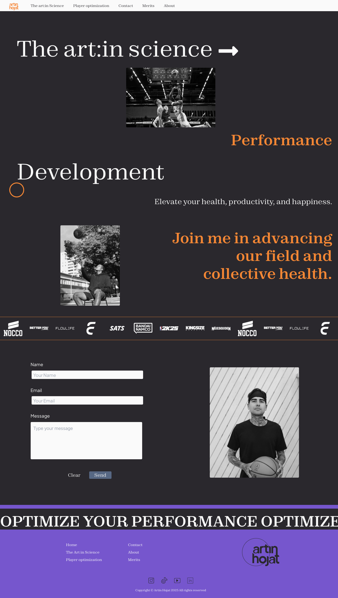     | 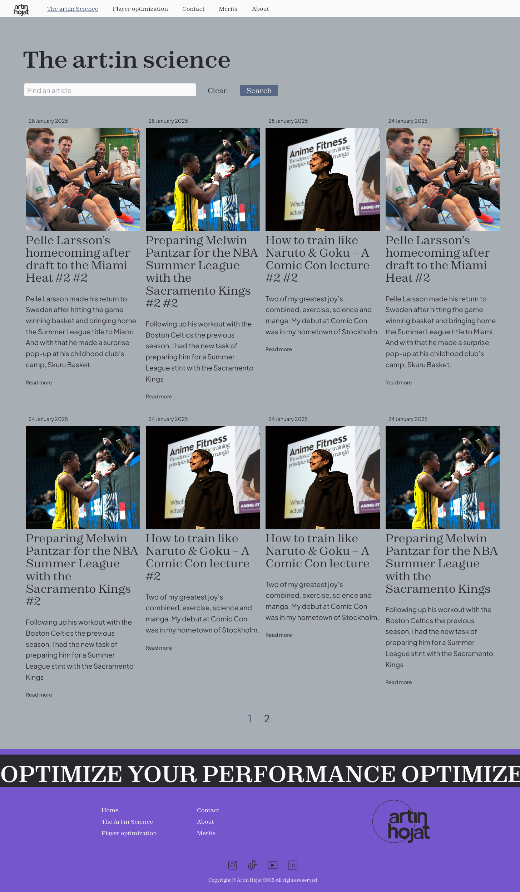 | 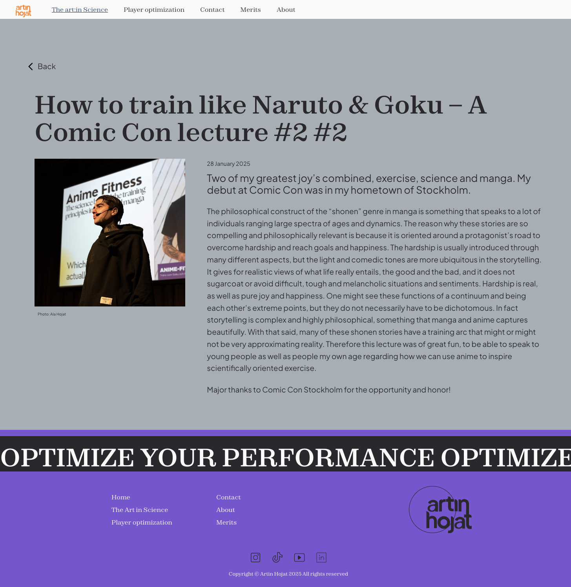 |
| Player                                                  | Contact                                                     | Merits                                                                  |
| 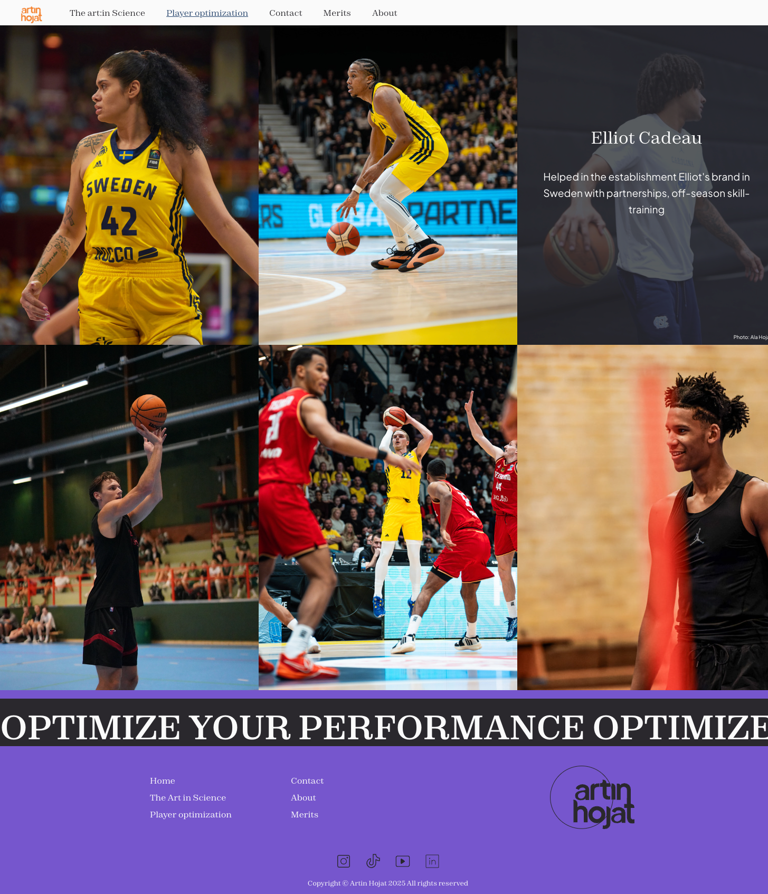 | 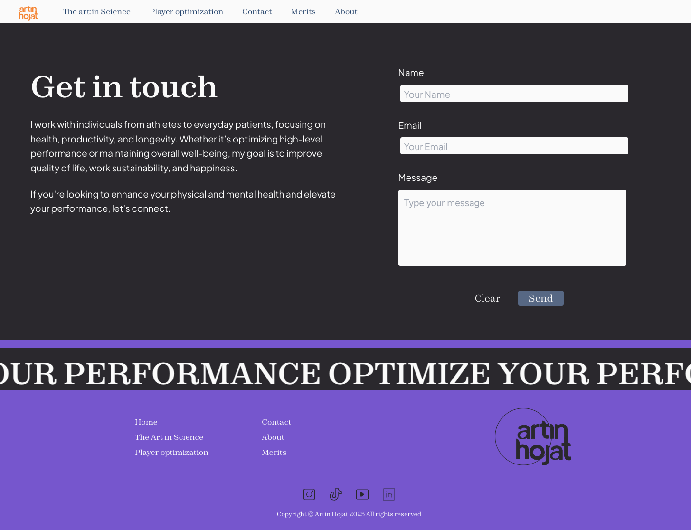   | 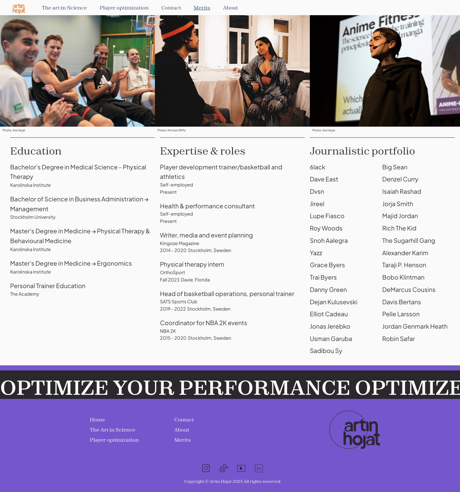                 |
| About                                                   |                                                             |                                                                         |
| 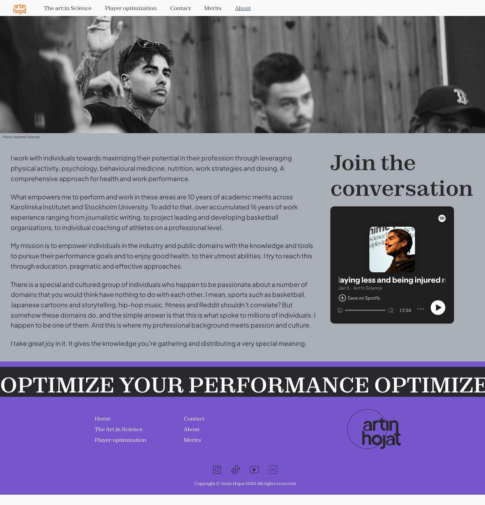        |                                                             |                                                                         |

## Final result in tablet

| **Title**                                             | **Title**                                                 | **Title**                                                             |
| ----------------------------------------------------- | --------------------------------------------------------- | --------------------------------------------------------------------- |
| Home                                                  | Articles                                                  | Single article                                                        |
| 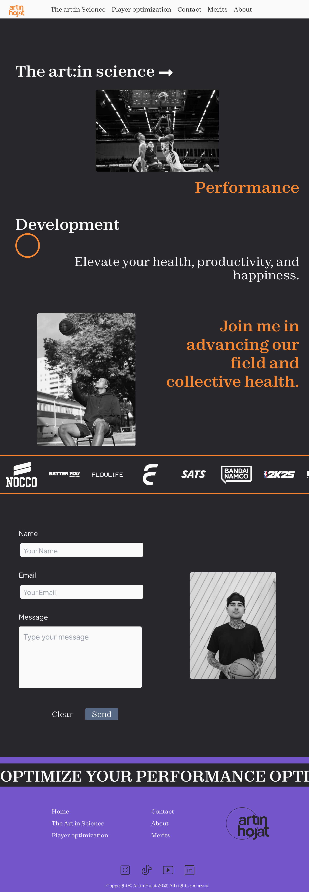     |  | 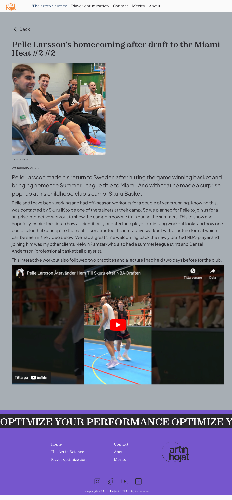 |
| Player                                                | Contact                                                   | Merits                                                                |
|  | 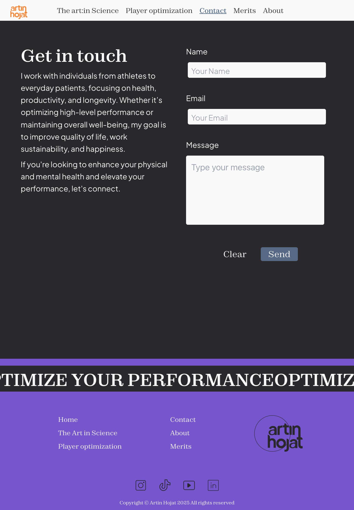   | 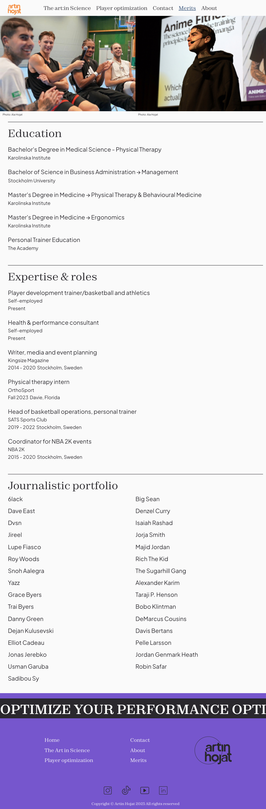                 |
| About                                                 |                                                           |                                                                       |
| 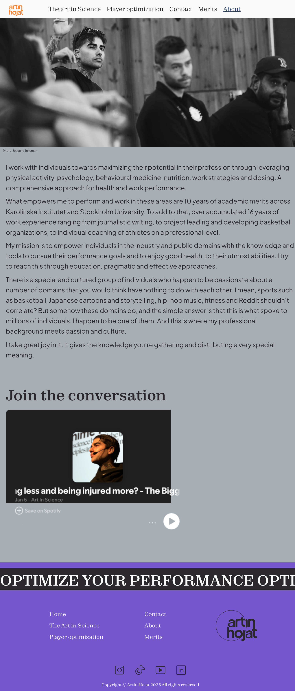   |                                                           |                                                                       |

## Final result in mobile

| **Title**                                             | **Title**                                                 | **Title**                                                             |
| ----------------------------------------------------- | --------------------------------------------------------- | --------------------------------------------------------------------- |
| Home                                                  | Articles                                                  | Single article                                                        |
| 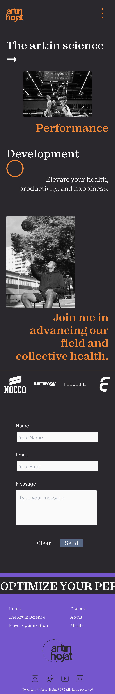     |  | 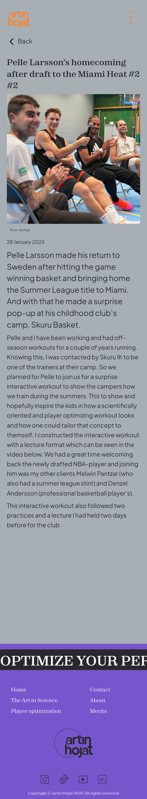 |
| Player                                                | Contact                                                   | Merits                                                                |
|  | 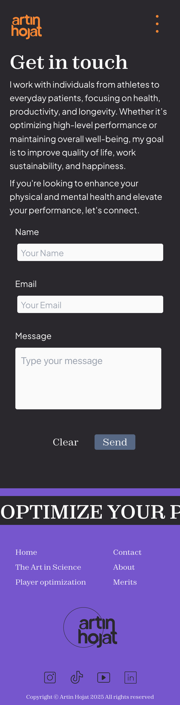   | 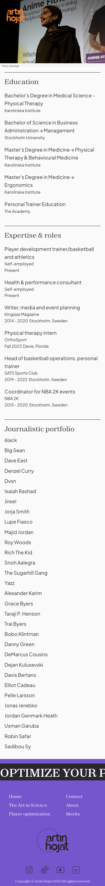                 |
| About                                                 |                                                           |                                                                       |
| 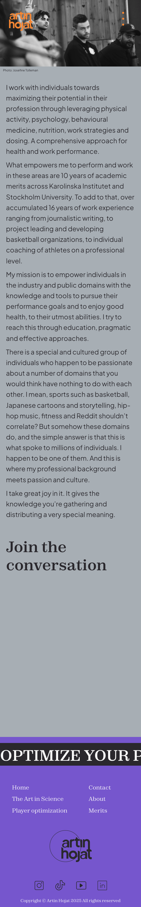   |                                                           |                                                                       |
